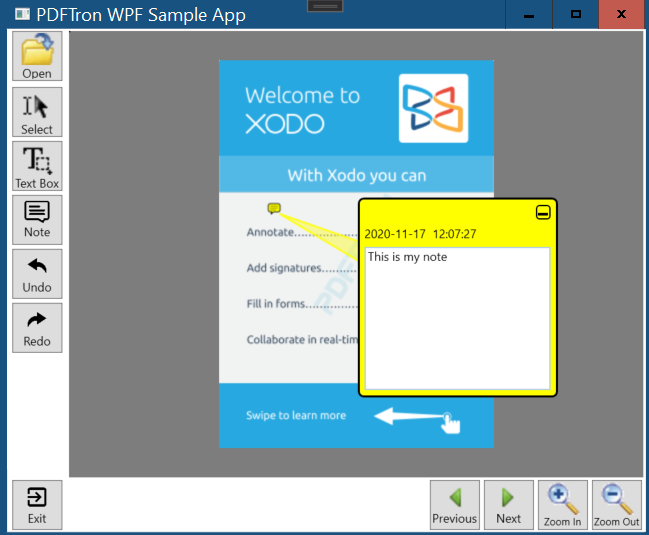

# PDFViewCtrol Viewer

Viewer integration using PDFViewCtrl and AnnotationToolbar
This sample demonstrate how to implement the PDFViewer on a WPF app using the MVVM pattern.

Platforms: x86, x64



## Project Structure
```
	PDFViewerWPFDemo/
		Properties/
		Resources/					- App resources
		ViewModel/					- MVVM files
		App.config
		App.xaml
		App.xaml.cs
		MainWindow.xaml					- Main View
		MainWindow.xaml.cs
		PDFViewerWPFDemo.csproj
	PDFViewerWPFDemo.sln
```

## Running the Sample

To run the sample, open the solution in Visual Studio 2017 or 2019 and restore all the Nuget packages


## License
See [License](./../LICENSE).
